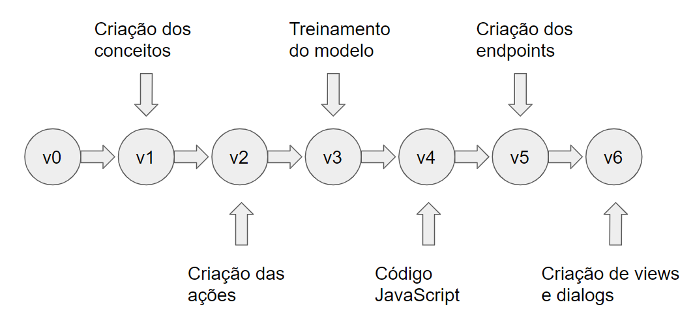
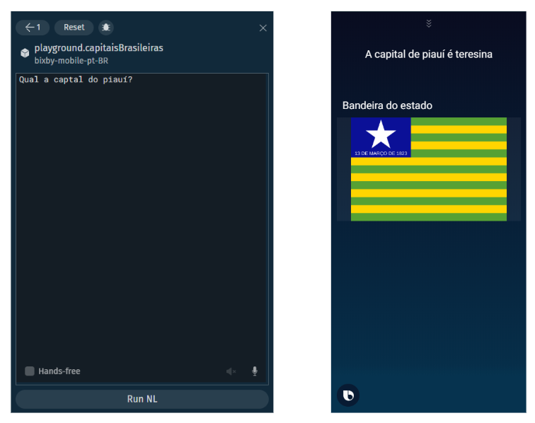

# CapsulaCaptaisBrasileiras

Este repositório contém o material de auxílio para o curso Desenvolvimento de Aplicação de Voz no Bixby Studio e cada pasta representa um passo que é detalhadamente explicado no curso, a imagem abaixo representa a linha de tempo do curso.

O resultado final do curso é uma cápsula (nome dado às aplicações da assistente de voz bixby) na qual o usuário pergunta qual a capital de um determinado estado brasileiro e recebe como resposta o nome da capital e a bandeira do estado. A foto abaixo ilustra essa cápsula.

Para se inscrever neste curso ou em outros cursos oferecidos pelo Samsung Ocean Center verifique a disponibilidade no site http://oceanbrasil.com/
